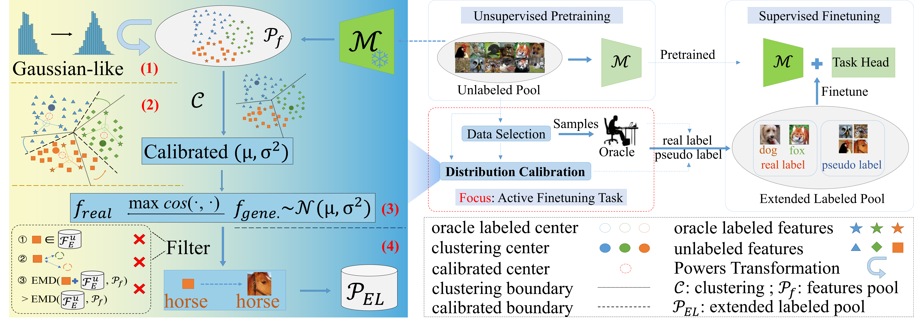

# ActiveDC: Distribution Calibration for Active Finetuning (CVPR 2024)

[](https://arxiv.org/abs/2311.07634)
[](https://github.com/VincentXu521/ActiveDC)

Wenshuai Xu, Zhenghui Hu, Yu Lu, Jinzhou Meng, Qingjie Liu, Yunhong Wang (Beihang University)

## Abstract

The pretraining-finetuning paradigm has gained popularity in various computer vision tasks. In this paradigm, the emergence of active finetuning arises due to the abundance of large-scale data and costly annotation requirements. Active finetuning involves selecting a subset of data
from an unlabeled pool for annotation, facilitating subsequent finetuning. However, the use of a limited number of training samples can lead to a biased distribution, potentially resulting in model overfitting. In this paper, we propose a new method called ActiveDC for the active finetuning tasks. Firstly, we select samples for annotation by optimizing the distribution similarity between the subset to be selected and the entire unlabeled pool in continuous space. Secondly, we calibrate the distribution of the selected samples by exploiting implicit category information in the unlabeled pool. The feature visualization provides an intuitive sense of the effectiveness of our method to distribution calibration. We conducted extensive experiments on three image classification datasets with different sampling ratios. The results indicate that ActiveDC consistently outperforms the baseline performance in all image classification tasks.
The improvement is particularly significant when the sampling ratio is low, with performance gains of up to 10%.

[[paper link]](https://arxiv.org/abs/2311.07634)



## Comparison with other Methods
Comparison with other active learning and active finetuning algorithms for Image Classification.


## Installation

#### Environment

This codebase has been developed with CUDA 11.1, python 3.9, PyTorch 1.10.0, and torchvision 0.11.1. Please install [PyTorch](https://pytorch.org/) according to the instruction on the official website.

You also need to install [pytorch-image-models 0.3.2](https://github.com/rwightman/pytorch-image-models) for model finetuning with [DeiT](https://github.com/facebookresearch/deit/blob/main/README_deit.md).

```
pip install timm==0.3.2
```
More details about environment install see file `env_init`.

#### Data Preparation

If you experiment on CIFAR10 or CIFAR100, the dataset would be automatically downloaded to `data_selection/data` and `deit/data`. For [ImageNet](https://www.image-net.org/), you have to manually download it and link to `data_selection/data/ImageNet` and `deit/data/ImageNet`. 

## ActiveDC

#### Feature Extraction

Before data selection, you need to extract the features with a pretrained model. 

```
cd data_selection/
python extract_feature.py --dataset ${DATASET (one of the three: CIFAR10, CIFAR100 or ImageNet)}
```

Our default setting applies the DeiT-Small model pretrained with DINO ([ckpt](https://dl.fbaipublicfiles.com/dino/dino_deitsmall16_pretrain/dino_deitsmall16_pretrain.pth)). You can also specify other models in `data_selection/extract_feature.py`.

#### Data Selection

With extracted features, you can select a subset from the dataset with the following command.

```
# For CIFAR10 or CIFAR100:
python sample_tools/ActiveFT_CIFAR.py --feature_path ${PATH to the extracted feature} --percent ${sampling percentage}

# For ImageNet:
python sample_tools/ActiveFT_ImageNet.py --feature_path ${PATH to the extracted feature} --percent ${sampling percentage}
```

#### Distribution Calibration
After data selection, you can calibration the distribution of selected samples.
```
# When you run this program for the first time, some commented-out code in the py file needs to be uncommented, such as sections related to file storage, etc.

python sample_tools/DC_v10.py -b CIFAR10 -d CIFAR10 --val --gpu --alpha 0.7 --xi 0.2 -p 1
```
For more parameter settings, please call ```python DC_v10.py --help``` to view;


## Model Finetuning

We implement the model finetuning based on the code base of [deit](https://github.com/facebookresearch/deit). You modify their code to allow the training on the data subsets.

First, make sure you have downloaded the pretrained ViT model. In our default setting, we finetune the DeiT-Small model pretrained with DINO ([ckpt](https://dl.fbaipublicfiles.com/dino/dino_deitsmall16_pretrain/dino_deitsmall16_pretrain.pth)).

Then, you can run the following command to finetune the model.

```
cd deit/
bash finetune_DC_**.sh
```
The finetuning process may be very sensitive to batch size or learning rate. To reproduce the number in the paper, we strongly recommend you to use the above command with 2 GPUs. If you prefer to finetune on a single GPU, you may need to double the batch size or half the learning rate.

<!-- []() -->

**Warning**：The current fine-tuning method is not the optimal one, and improvements on the fine-tuning methods will be discussed in other research works.

## Acknowledgment

This repo code is developed based on [ActiveFT](https://github.com/yichen928/ActiveFT) and [FAISS](https://github.com/facebookresearch/faiss). We sincerely thank the authors for making their projects open-source.

## Reference

If you find our work useful, please consider citing the following paper:

```
@inproceedings{xws2024activedc,
  title={ActiveDC: Distribution Calibration for Active Finetuning},
  author={Wenshuai Xu and Zhenghui Hu and Yu Lu and Jinzhou Meng and Qingjie Liu and Yunhong Wang},
  booktitle={Conference on Computer Vision and Pattern Recognition 2024},
  year={2024},
  url={https://openreview.net/forum?id=YZkFpCdx3A}
}
```

